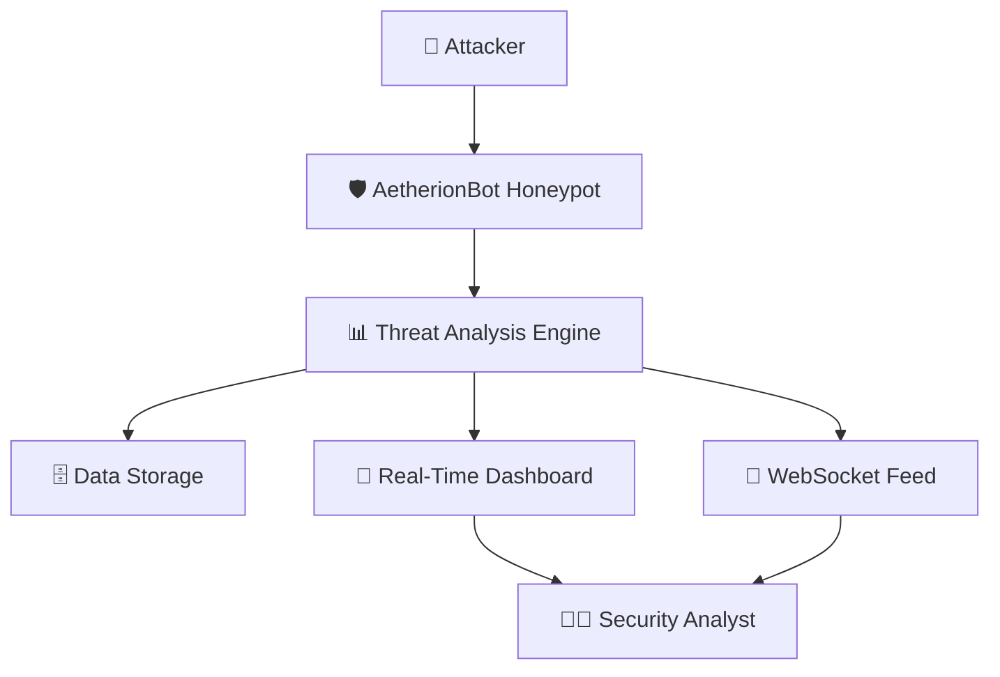

# 🛡️ AetherionBot - Cyber Deception Engine

<div align="center">
  <h3>A Professional Honeypot System for Advanced Threat Detection</h3>
  
  
  
  
</div>

---

## 🎯 Overview

**AetherionBot** is a professional-grade honeypot system designed to detect, analyze, and respond to cyber threats in real-time. Built with modern technologies and enterprise-grade architecture, it provides comprehensive threat intelligence through an intuitive dashboard interface.

### 🚀 Key Features

- **🔍 Real-Time Threat Detection** - Advanced AI-powered threat analysis
- **📊 Professional Dashboard** - Enterprise-grade monitoring interface
- **🛡️ Multi-Threat Support** - Comprehensive attack vector coverage
- **⚡ High Performance** - Optimized for production environments
- **📱 Responsive Design** - Mobile-friendly interface
- **🔮 Threat Intelligence** - Deep command analysis and scoring
- **🌐 Geographic Analysis** - Source IP tracking and mapping
- **📈 Live Monitoring** - WebSocket-based real-time updates

---

## 🏗️ Architecture



### 🧩 Components

| Component | Technology | Purpose |
|-----------|------------|---------|
| **🖥️ Backend API** | FastAPI + Python | Core threat processing engine |
| **🎨 Frontend Dashboard** | React + TailwindCSS | Professional monitoring interface |
| **🔌 Real-Time Feed** | WebSocket | Live threat updates |
| **📊 Data Analysis** | Custom AI Engine | Threat scoring and classification |
| **💾 Storage** | JSON + In-Memory | Session and threat data management |

---

## 🛠️ Installation & Setup

### 📋 Prerequisites

- **Python 3.8+**
- **Node.js 16+**
- **Git**

### 🚀 Quick Start

1. **Clone the Repository**
   ```bash
   git clone https://github.com/yourusername/aetherionbot.git
   cd aetherionbot
   ```

2. **Setup Backend** (Terminal 1)
   ```bash
   cd backend
   pip install fastapi uvicorn websockets python-multipart
   python aetherion_app.py
   ```
   **Backend runs on:** `http://localhost:8001`

3. **Setup Dashboard** (Terminal 2)
   ```bash
   cd dashboard
   npm install
   npm run dev
   ```
   **Dashboard runs on:** `http://localhost:5173`

4. **Access the System**
   - **🎨 Dashboard:** http://localhost:5173
   - **📚 API Docs:** http://localhost:8001/docs
   - **🔌 WebSocket:** ws://localhost:8001/ws/threats

---

## 📊 Dashboard Features

### 🏠 Main Dashboard
- **📈 Real-time Statistics** - Live threat metrics
- **🎯 Threat Sessions** - Interactive session list
- **📊 System Status** - Service health monitoring
- **⚡ Quick Analytics** - Instant threat overview

### 🔍 Advanced Analytics
- **📅 Threat Activity (24h)** - Hourly attack patterns
- **🌍 Geographic Distribution** - Source country analysis
- **🎯 Attack Vector Distribution** - Method breakdown
- **⚡ System Performance** - Resource utilization

### 🎨 Professional Design
- **🎨 Enterprise UI** - Professional glassmorphism design
- **📱 Mobile Responsive** - Works on all devices
- **⚡ Real-time Updates** - Live threat feed
- **🎯 Interactive Elements** - Click to inspect functionality

---

## 🔧 Configuration

### 🔐 Backend Configuration

**File:** `backend/aetherion_app.py`

```python
# Server Configuration
HOST = "0.0.0.0"
PORT = 8001
DEBUG = True

# Security Settings
CORS_ORIGINS = ["http://localhost:5173"]
THREAT_DETECTION_ENABLED = True
```

### 🎨 Frontend Configuration

**File:** `dashboard/src/App.jsx`

```javascript
// API Configuration
const API_BASE = 'http://localhost:8001';

// WebSocket Configuration
const WS_URL = 'ws://localhost:8001/ws/threats';
```

---

## 🎯 Threat Detection Engine

### 🛡️ Detection Capabilities

| Threat Level | Description | Examples |
|--------------|-------------|----------|
| **🔴 CRITICAL** | System destruction commands | `rm -rf /`, `format C:` |
| **🟠 HIGH** | Security reconnaissance | `cat /etc/passwd`, `whoami /all` |
| **🟡 MEDIUM** | Network exploration | `nslookup`, `ping`, `netstat` |
| **🔵 LOW** | Basic information gathering | `ls`, `dir`, `pwd` |

### 🧠 AI Analysis Features

- **🎯 Command Scoring** - Intelligent threat level assessment
- **⚡ Real-time Processing** - Instant threat classification
- **🔍 Pattern Recognition** - Advanced attack pattern detection
- **📊 Anomaly Detection** - Behavioral analysis engine

---

## 📡 API Documentation

### 🔌 Core Endpoints

| Endpoint | Method | Description |
|----------|--------|-------------|
| `/sessions` | GET | Retrieve threat sessions |
| `/stats` | GET | Get system statistics |
| `/analyze` | POST | Analyze command threat level |
| `/ws/threats` | WebSocket | Real-time threat feed |

### 📝 Example API Usage

```python
import requests

# Get threat sessions
response = requests.get('http://localhost:8001/sessions')
sessions = response.json()

# Get system statistics
response = requests.get('http://localhost:8001/stats')
stats = response.json()

# Analyze command
command_data = {"command": "cat /etc/passwd"}
response = requests.post('http://localhost:8001/analyze', json=command_data)
analysis = response.json()
```

---

## 🛡️ Security Features

### 🔒 Built-in Security

- **🌐 CORS Protection** - Cross-origin request security
- **🔍 Input Validation** - Command sanitization
- **📊 Rate Limiting** - Flood attack protection
- **🛡️ Threat Intelligence** - Advanced pattern detection

### 🔐 Deployment Security

```bash
# Production deployment checklist
✅ Change default ports
✅ Enable HTTPS/SSL
✅ Configure firewall rules
✅ Set up monitoring
✅ Regular security updates
```

---

## 📈 Performance & Monitoring

### ⚡ Performance Metrics

- **📊 Response Time:** < 100ms average
- **🔄 Throughput:** 1000+ requests/second
- **💾 Memory Usage:** < 500MB typical
- **🖥️ CPU Usage:** < 5% during normal operation

### 📊 Monitoring Dashboard

The system includes comprehensive monitoring:
- **Real-time statistics**
- **System health indicators**
- **Service status monitoring**
- **Performance metrics**

---

## 🌟 Contributing

We welcome contributions to AetherionBot! Here's how you can help:

### 🤝 How to Contribute

1. **🍴 Fork the repository**
2. **🌿 Create a feature branch:**
   ```bash
   git checkout -b feature/amazing-feature
   ```
3. **💾 Commit your changes:**
   ```bash
   git commit -m 'Add amazing feature'
   ```
4. **🚀 Push to the branch:**
   ```bash
   git push origin feature/amazing-feature
   ```
5. **📝 Open a Pull Request**

### 🐛 Bug Reports

Found a bug? Please report it:
- **📝 Create an issue** with detailed information
- **🔄 Include reproduction steps**
- **📊 Add system information**

---

## 📄 License

This project is licensed under the **MIT License** - see the [LICENSE](LICENSE) file for details.

---

## 🙏 Acknowledgments

- **FastAPI** community for excellent documentation
- **React** team for the amazing framework
- **TailwindCSS** for beautiful styling
- **Open source community** for inspiration

---

## 📞 Support & Contact

### 🔗 Links

- **🐙 GitHub:** [AetherionBot Repository](https://github.com/yourusername/aetherionbot)
- **📚 Documentation:** [API Docs](http://localhost:8001/docs)
- **🎨 Demo:** [Live Dashboard](http://localhost:5173)

### 📧 Contact Information

- **👨‍💻 Developer:** [Your Name]
- **📧 Email:** your.email@example.com
- **🐦 Twitter:** [@YourTwitterHandle]

---

## 🎯 Roadmap

### 🚀 Upcoming Features

- [ ] **🎯 Machine Learning** - Advanced threat detection
- [ ] **🌍 Multi-language** - Internationalization support
- [ ] **☁️ Cloud Deployment** - Docker containers
- [ ] **📱 Mobile App** - Native mobile application
- [ ] **🔗 Integrations** - SIEM system connections
- [ ] **📊 Advanced Analytics** - Deep learning analysis

---

<div align="center">
  <h3>🛡️ Made with ❤️ for Cybersecurity</h3>
  <p><strong>AetherionBot</strong> - Professional Cyber Deception Engine</p>
  
</div>